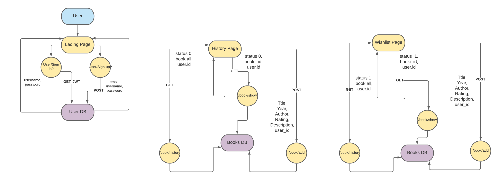
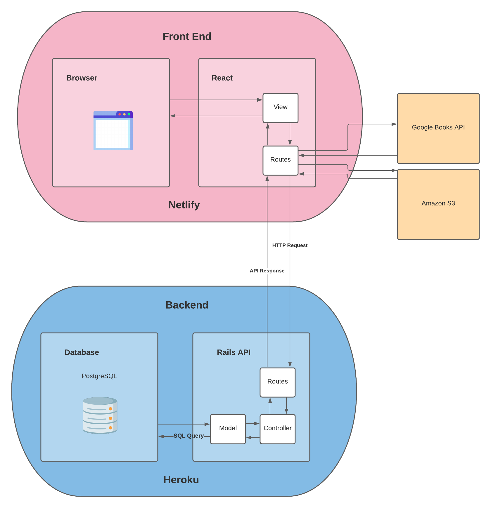
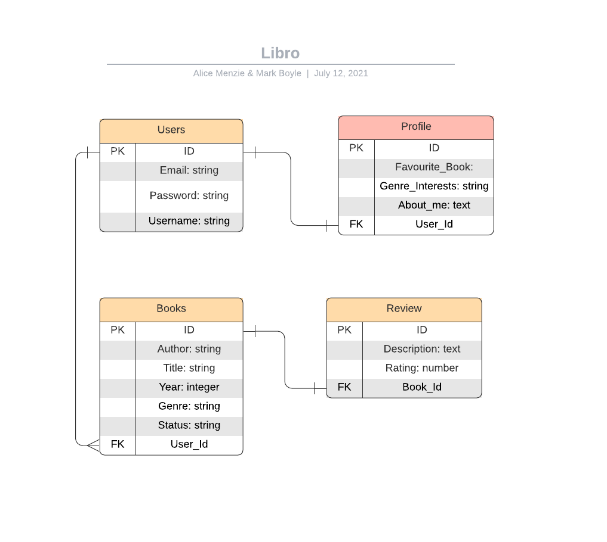
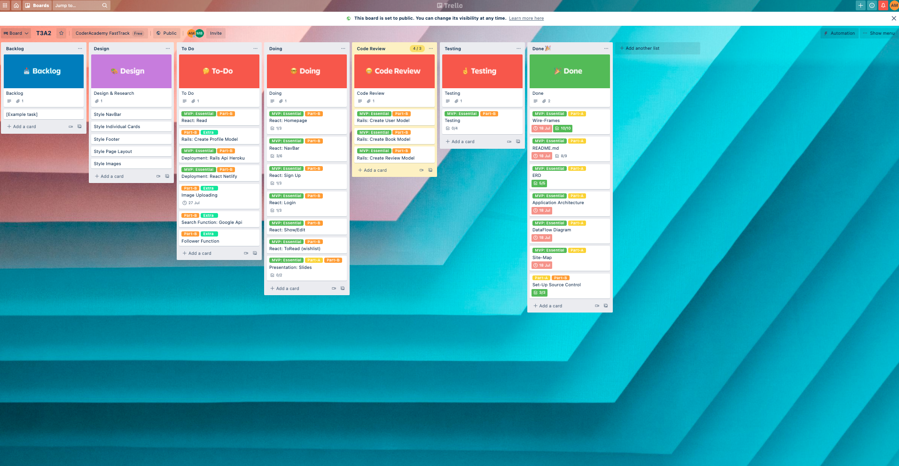
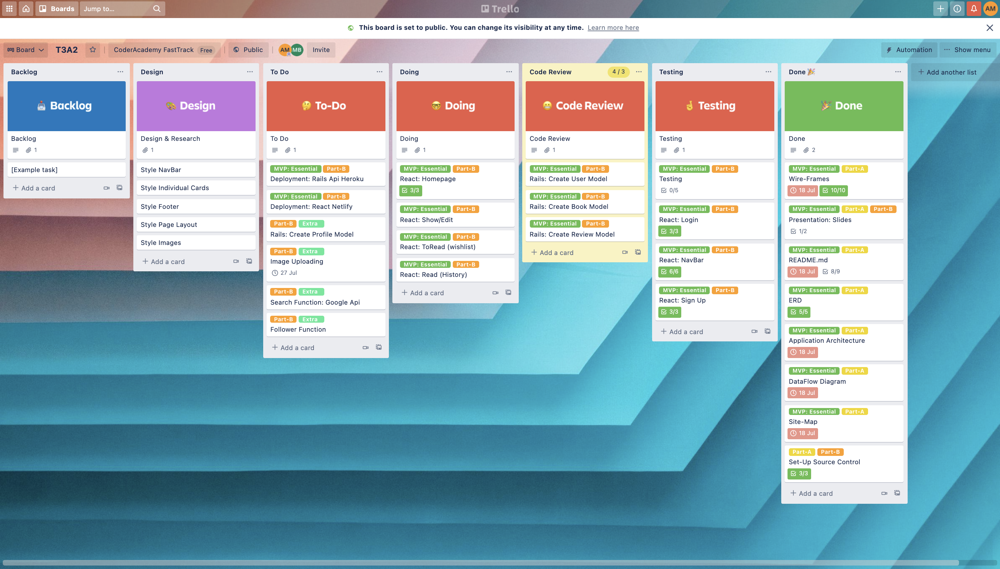
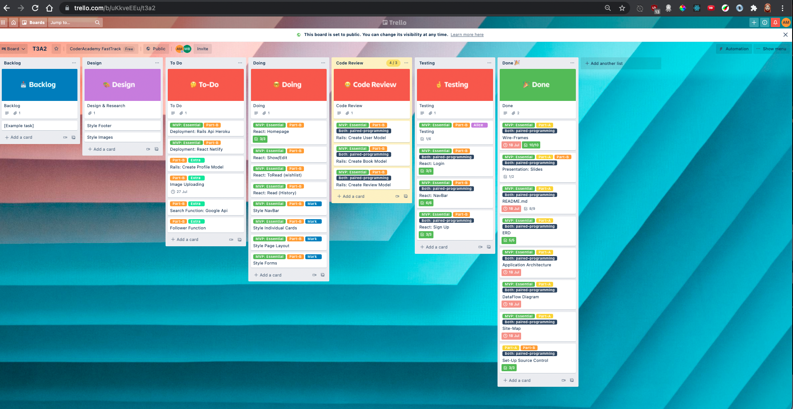

# T3A2-A Full Stack Application #

## Deployed site 

**Frontend**

https://libro-books.netlify.app/

**Backend**

https://libro-backend.herokuapp.com/

**GitHub**

https://github.com/AliceMenzie/T3A2_client
https://github.com/Mark-Boyle/T3A2_client
https://github.com/AliceMenzie/Libro_server
https://github.com/Mark-Boyle/Libro_server

## Testing 

**Client/Manual**

https://docs.google.com/spreadsheets/d/1q37Xoi31z3zsn1oOg14R7nbzc13L_aQHAvVeVFKukOg/edit?usp=sharing

## Libro ##

### Purpose ###

We were hired by Dymocks to provide an application that their customers can use to keep a record of books that they want to read. Currently their customers browse the bookstore and discover lots of books that really interest them. But since they don't have enough spare time they can only read a certain number of books each year. By the time they have finished reading the books they currently have, they will have forgotten the books they discovered previously. This application provides them with a space to record all the books that they discover to ensure no books are forgotten about. 

Along with a book wishlist, the application will allow users to maintain a list of books that they have read, and give those books ratings and reviews. This will allow other users to see what books are receiving high ratings, and can read the reviews from other users. This will provide a space for users to go for recommendations, inspiration and see ratings for other books.

### Functionality / features ###

- **Create a user account:** Users have the ability to create a new account when they sign up. They provide a username, email, and password. They are asked to confirm the password to ensure they have typed it correctly. Once they have a user account they can log back in whenever they like and see all the books and profile information attached to their user account.

- **Create a user profile:** Users can create a profile for their account which will show 'Favourite Book', 'Favourite Genres', and an 'About Me' section. This allows the user to make their account more personal and allows other users to understand more about the user. 

- **Give Reviews and ratings on books:** Once the user has read a book they can give it a rating and a review. The rating is out of 5 stars. These reviews can be seen by other users if they click on that book on the homepage. The ratings will be used to create the order that the books appear on a users homepage. The better the rating, the higher it appears on the page.

- **CRUD functionality for books:** The user has the ability to add new books, show the book's details on a show page, update the details, and delete the book.

- **Have a wishlist of books for each user:** When the user adds a book, they indicate if they have read the book. This allows for a page to be created with all the books they are yet to read, which is their book wishlist. The wishlist will have a seperate page that the user goes to for seeing the books that they are yet to read. The user can change the status of a book to 'read' once they have read it. This will remove the book from the wishlist and add it to the history page.

- **Have a history of books read by a user:** A History page will display all the books that the user has already read. They can click on the book and give it a review and rating. 

- **Have a landing page with books that have a good rating from other users:** The home page will display books that have been given a good rating by other users. They can be any book regardless of whether the user has adding them to their own account or not. It will provide the user with an opportunity to view books that other users have recommended.

- **Upload images of book covers:** The user can upload an image of the the bookcover. They attach this to the book, and it's displayed on the book card. This will allow the application to look more visual appealing. It will have all the colours and artwork displayed throughout the different pages. The images will be stored in an AWS S3 bucket.

- **Search Google books to get details about books:** An extra feature will allow the user to search the google books API to find details of a book.

- **Follow another user to see the books that they recommend:** An extra feature is the ability to follow another user and see the books that they recommend. 

### Target audience ###

Libro's primary audience is for book lovers and enthusiasts. It is primarily for those who wish to keep a track of their reading activities. Additionally Libro is for those who love keeping a history of books they have read, setting goals for books they wish to read, keeping track of their favourite books and making personal reviews. 

It is great for individuals who read a variety of formats such as ebook, hard copy and audiobooks.

Libros aim is to encourage readers of all ages to read through fostering good reading habits via record keeping. 

Libro also aims to connect individuals together and aims to reach users that have an interest in following others reading journeys and reading other users reviews. 

### Tech stack ###

**Frontend**
- ReactJS

**Backend**
- Ruby 
- Rails 

**Database**
- PostgreSQL

**DevOps** 
- Heroku 
- Netlify

**Version Control** 
- Git 
- GitHub
- Forking Workflow & Paired Programming

**Project Management** 
 - Trello 
 - Discord

**Design**
 - Bootstrap
 - Figma 
 - Lucidchart

 **Image Storage**
 - AWS S3

 **Others**
- Google Books API 

### Dataflow Diagram ###

### Application Architecture Diagram ###

### Sitemap ###

<!--  -->

### ERD ###

### User Stories ###

“As a lover of books, I want to be able store a wishlist of books I want to read, so that I don't forget which books I have previously discovered. Too often I go into a bookstore and discover dozens of books that really interest me. I would love to read them all but I struggle to find the time. I need to be able to have all the books I want to read in one place, so when I am ready to buy another book I can choose from that list.”

"As a lover of books, I want to be able to store all the books that I have read, so that I can show them to my friends when they ask for recommendations. I read lots of books that I love and want to recommend to others, but sometimes I can't remember what they all are. When friends ask me for recommendations I want a list of books that I can easily show them, and ensure I haven't forgotten any."

"As a user of Libro, I want to be able to update my wishlist and history, so that it is always up to date. I need to be able to add books when I discover more. Mark it as read or unread depending on which list it needs to go in. Change the status to 'read' once i have finished the book so that it moves to the history page. Delete a book if I no longer wish it to be part of my account." 

"As a user of Libro, I want to be able to upload images of bookcovers for the books I've added to my account and have them displayed with the book's information, so that it makes the application a lot more visually appealing." 

"As a user of Libro, I want to be able to search for details of a book, so that I can fill in all the details even if I don't know them. I would like access to an API such as Google books to find book details."

"As a bookstore owner, I want to be able to see what books my customers have enjoyed reading. I would like see the ratings and reviews that they have given books so I know which books I should be promoting. I can't read every book in the bookstore so I rely heavily on other peoples opinions to know what are the best books. Seeing customer reviews is very valuable to me. I need to have a homepage that shows lots of different books, what rating it was given, who is the user that gave the rating, and when I click on the book I can read their review."

"As a lover of books, I want to see what books other people have enjoyed. I love discovering new books and I would like a space where I can see other peoples ratings and reviews. It would be useful for when I have a book I'm thinking about reading, to see how other people rated it. It would also be useful for when I want inspiration and browse through a list of books that have a high rating."

"As a lover of books, I would like to see the books that a certain person have recommended. I have similar tastes to them and would like to keep up to date with what they have been reading. I would follow that user's profile and be able to check all the books they have read and see the rating and reviews they gave. On the homepage when I see a book with a good rating, I want to be able to see the username, click on it and it takes me to that user's profile."

"As an publisher of books, I would like to be able to keep in touch with what people are reading, and the ratings and reviews they are giving each book. It will help me to understand what are the current trends, and help me to decide what type of books I should be publishing. Being able to see all the ratings and reviews to users give to books is valuable customer research for me. I would like to be able to go to a user's profile and see their favourite book, favourite genres, and an about me section to understand customers better and what their interests are."

### Q5 Wireframes for multiple standard screen sizes, created using industry standard software

### WireFrame: Initial Consult

### WireFrame: Follow-up Consult

**Follow-up Consult with Dymocks Notes**

**MVP**

They are open to navigation bar changes, with the tablet view either as shown or more similar to the mobile view.

**Extras**

Will need additional consultation with dymocks to fleshout feature: *follow other users*

### Q6 Screenshots of your Trello board throughout the duration of the project

https://trello.com/b/uKkveEEu/t3a2

**Task Delegation**

Each morning we would have a stand up where we discussed what we had achieved the previous day, what issues we had, and what we wanted to achieve for the current day. In these discussions we would look at the trello board and delegate tasks for ourselves. We would look at the tasks left in the 'To-Do' section or backlog, decide who would be allocated to those tasks, or if we would do it in pair-programming, then attach the corresponding label to the task and move it into the 'Doing' section. This allowed us to clearly see who was working on each task.

**Day1**

Today we started with planning and working with the Dymocks team. They outlined to us their requriements for a booking application for their clients. We made an outline for all the tasks required, time allocated and if it was part of the MVC and any additional features.

**Day2**

Today we continued to work on the planning, we summarised the purpose, target audience and features of our application. We worked on the application architecture, sitemap and initial wireframing.  

**Day3**

Today we did more planning we continued to work on the application architecture, sitemap and our wireframes. Additionally we started our dataflow diagram, ERD and set up our source control. 

**Day4**

Today we started setting up the server side of Libro, creating the book and review models. 

**Day5**

Today we continued setting up the server side of Libro, reviewing the models from the previous day and adding in the user model. We also started the client side of the application, with initial setup and page views for the home, sign up and login. 

**Day6**

Today we finialised the initial set up of our server and put our models in code review as updates will be needed whilst developing the client side of our application. We continued to work on the client side of the application adding in a navigation bar and forms to the login and sign up pages.

We made needed changes to implement connectivity between the client and server sides of our application CORS and JWT.

**Day7**

Today we had a major review of our planning and another meeting with Dymocks, we finalised serveral aspects relating to the users needs (user stories) and the project going forward. Such as reviewing and making changes to the application architecture, wireframes and dataflow diagram. 

### UPDATED 

**Day9**

Today we continued to work on our MVP together, working on navbar, sign up, login, history, wishlist and homepage.  

**Da10**

Today we deployed our website front and backend.

**Day11**

Today we worked seprately on design and testing. Redeployed site

**Day12**

Today we finalised documentation and the slideshow.