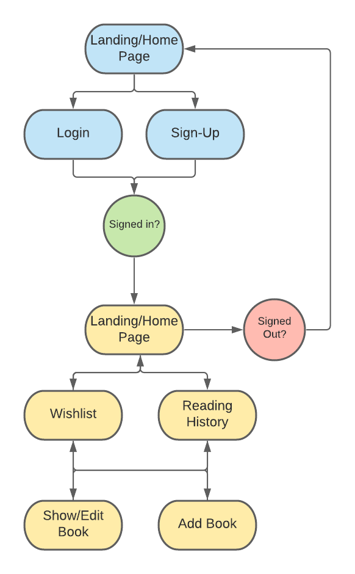

# T3A2-A Full Stack Application #

## Libro ##

### Purpose ###

We were hired by Dymocks to provide an application that their customers can use to keep a record of books that they want to read. Currently their customers browse the bookstore and discover lots of books that really interest them. But since they don't have enough spare time they can only read a certain number of books each year. By the time they have finished reading the books they currently have, they will have forgotten the books they discovered previously. This application provides them with a space to record all the books that they discover to ensure no books are forgotten about. 

Along with a book wishlist, the application will allow users to maintain a list of books that they have read, and give those books ratings and reviews. This will allow other users to see what books are receiving high ratings, and can read the reviews from other users. This will provide a space for users to go for recommendations, inspiration and see ratings for other books.

### Functionality / features ###

### Target audience ###

Libro's primary audience is for book lovers and enthusiasts. It is primarily for those who wish to keep a track of their reading activities. 

Libro is for those who love keeping a history of books they have read, setting goals for books they wish to read, keeping track of their favourite books and making personal reviews. 

It is great for individuals who read a variety of formats such as ebook, hard copy and audiobooks.

Libros aim is to encourage readers of all ages to read through fostering good reading habits via record keeping. 

### Tech stack ###

**Frontend**
- ReactJS

**Backend**
- Ruby 
- Rails 

**Database**
- PostgreSQL

**DevOps** 
- Heroku 
- Netlify

**Version Control** 
- Git 
- GitHub
- Forking Workflow 

**Project Management** 
 - Trello 
 - Discord

**Design**
 - Boostrap
 - Figma 

 **Others to think about**
- AWS S3 ?
- google book API ?

### Dataflow Diagram ###

"What is a dataflow diagram"
https://www.lucidchart.com/pages/data-flow-diagram

### Application Architecture Diagram ###

### Sitemap ###

<!--  -->

### User Stories ###

“As a lover of books, I want to be able store a wishlist of books I want to read, so that I don't forget which books I have previously discovered. Too often I go into a bookstore and discover dozens of books that really interest me. I would love to read them all but I struggle to find the time. I need to be able to have all the books I want to read in one place, so when I am ready to buy another book I can choose from that list.”

"As a lover of books, I want to be able to store all the books that I have read, so that I can show them to my friends when they ask for recommendations. I read lots of books that I love and want to recommend to others, but sometimes I can't remember what they all are. When friends ask me for recommendations I want a list of books that I can easily show them, and ensure I haven't forgotten any."

"As a bookstore owner, I want to be able to see what books my customers have enjoyed reading. I would like see the ratings and reviews that they have given books so I know which books I should be promoting. I can't read every book in the bookstore so I rely heavily on other peoples opinions to know what are the best books. Seeing customer reviews is very valuable to me."

"As a lover of books, I want to see what books other people have enjoyed. I love discovering new books and I would like a space where I can see other peoples ratings and reviews. It would be useful for when I have a book I'm thinking about reading, to see how other people rated it. It would also be useful for when I want inspiration and browse through a list of books that have a high rating."

"As a lover of books, I would like to see the books that a certain person has recommended. I have similar tastes to them and would like to keep up to date with what they have been reading. I would follow that user's profile and be able to check all the books they have read and see the rating and reviews they gave."

"As an publisher of books, I would like to be able to keep in touch with what people are reading, and the ratings and reviews they are giving each book. It will help me to understand what are the current trends, and help me to decide what type of books I should be publishing. Being able to see all the ratings and reviews to users give to books is valuable customer research for me."

### Q5 Wireframes for multiple standard screen sizes, created using industry standard software

this is where we put the wireframes

### Q6 Screenshots of your Trello board throughout the duration of the project

**Day1**

**Day2**

